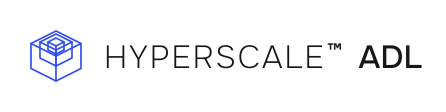

<p align="left">
<picture>
  <source media="(max-width: 600px) and (prefers-color-scheme: dark)" srcset="docs/assets/brand/adl-stacked-white.svg">
  <source media="(max-width: 600px)" srcset="docs/assets/brand/adl-stacked.svg">
  <source media="(prefers-color-scheme: dark)" srcset="docs/assets/brand/adl-horizontal-white.svg">
  <source media="(prefers-color-scheme: light)" srcset="docs/assets/brand/adl-horizontal.svg">
  
</picture>
</p>

# ADL

ADL declares provider bindings and the instruction and observation contract for external work. HSX authors money behavior; UDL carries that contract into execution. The runtime owns money accounts, reservations and evidence consumption.

## Install

```bash
npm install @hyperscale0/adl
```

Pre-1.0 releases are prerelease versions (alpha and beta). Pin an exact version if needed: until 1.0.0, a change to the surface ships as a minor bump, not a major. ADL depends on `@hyperscale0/udl` for object field schema validation.

## Adapter declaration

Use `createProviderAdapterRegistry` to validate `ProviderAdapter` declarations and `adapterConformanceFindings` to report incomplete bindings. `BoundaryAdapter` dispatches immutable `BoundaryInstruction` values and returns explicit `BoundaryObservation` values. HTTP success never confirms settlement.

The [generic fixture](src/boundary-fixture.ts) has no network, clock or account policy. Check it from this package:

```sh
bun run conformance -- ./src/boundary-fixture.ts
```

## Documentation

- [Authoring guide](docs/authoring-guide.md)
- [Conformance test cases](conformance/cases.json)
- [Subject adapter fixture](conformance/subject-adapter.ts)
- [Manifest JSON schema](spec/manifest.schema.json)
- [Contributing](CONTRIBUTING.md)

## Versioning

Semantic versioning from 1.0.0. Until then, prereleases may change the surface on a minor version. Removing a value from a vocabulary in `src/vocabulary.ts` is a breaking change documented in [CHANGELOG.md](CHANGELOG.md).

## License and security

ADL is licensed under the Hyperscale Intellectual Property and Copyright License, Tier 2 (Source Available), with a commercial license available from Hyperscale LLC. It is not open source. See [LICENSE.md](LICENSE.md) and [NOTICE.md](NOTICE.md).

Vulnerability reports go through private disclosure as described in [SECURITY.md](SECURITY.md).

---

Hyperscale™ is a trademark of Hyperscale LLC. Code licenses do not grant rights to the name or marks.
