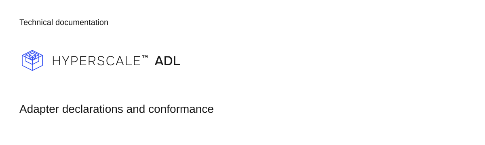

# ADL

ADL is the Adapter Declaration Language: the public format for declaring how a bank or provider behaves at the control-plane boundary. Its validator and conformance suite refuse incomplete interface facts before a generic runtime can poll, classify, reconcile, or deduplicate provider results. The three language boundaries stay separate: HSX authors settlement behavior, UDL defines the canonical product contract, and ADL declares how an external provider performs or confirms work behind that contract.

**Status: beta.** Current release is 1.0.0-beta.1. Pre-1.0 releases can change on minor versions until 1.0.0.

## Adapter symmetry

Hyperscale first-party bank adapters are written against this package and nothing more. There is no private adapter API and no second interface for first-party code. When an adapter needs a seam ADL lacks, the seam is added here, in public, or not at all.

An adapter is a declaration, not a client. It is a plain object stating what the provider does: which commands exist, how responses classify, what bank status tokens mean, when statements can be fetched, and which reference returns on a debit. The generic execution runtime ships with the platform. An adapter opens no sockets, holds no credentials, and decides nothing about what a payment means.

Conformance checks a declaration. It does not contact a bank, verify a credential, certify regulatory readiness, or make a Product live.

## Install

```bash
npm install @hyperscale0/adl
```

Pre-1.0 releases are prerelease versions (alpha and beta). Pin an exact version if needed: until 1.0.0, a change to the surface ships as a minor bump, not a major. The package has no runtime dependencies.

## Adapter declaration

A provider adapter declaration using verified package exports and the repository example profile:

```ts
import {
  certifyPartnerBankAdapter,
  createProviderAdapterRegistry,
  type ProviderAdapterVocabulary,
} from "@hyperscale0/adl";
import { meridianProfile } from "./examples/meridian-bank/index.js";

interface MyVocabulary extends ProviderAdapterVocabulary {
  capability: "payout_execution";
  operation: "payout.submit";
  resource: "payout";
}

const defineAdapters = createProviderAdapterRegistry<MyVocabulary>();

export const adapters = defineAdapters([
  {
    provider: "meridian_bank",
    capability: "payout_execution",
    egress: "rest",
    operationMap: {
      "payout.submit": {
        operation: "payout.submit",
        direction: "tenant_initiated",
        envelope: "http_status_error_body",
        statusEnquiry: {
          keys: "provider_reference",
          pathTemplate: "/v2/payments/{providerReference}",
        },
        obligationKind: "payout_submission",
        resourceKind: "payout",
        resourceIdPath: "payoutId",
      },
    },
    webhookMap: {},
    bindings: { payout: "claim" },
    config: {
      credentialRef: { source: "environment", name: "MERIDIAN_CREDENTIALS" },
    },
    profile: meridianProfile,
  },
]);

for (const adapter of adapters) {
  certifyPartnerBankAdapter(adapter);
}
```

`createProviderAdapterRegistry` validates at import and preserves literal types. `certifyPartnerBankAdapter` throws with every gap listed at once; an empty finding list is the certification.

Check an adapter declaration with conformance:

```bash
bun run conformance -- ./examples/meridian-bank
```

```
ok    meridian_bank:payout_execution
ok    meridian_bank:bank_credit
2 adapter(s) checked, 0 finding(s) reported
```

The command exits 0 on success and 1 when findings are reported.

## Documentation

- [Authoring guide](docs/authoring-guide.md)
- [Meridian Bank example](examples/meridian-bank)
- [Conformance test cases](conformance/cases.json)
- [Manifest JSON schema](spec/manifest.schema.json)
- [Contributing](CONTRIBUTING.md)

## Versioning

Semantic versioning from 1.0.0. Until then, prereleases may change the surface on a minor version. Conformance codes are append-only: a released code is never renamed or removed. Removing a value from a vocabulary in `src/vocabulary.ts` is a breaking change documented in [CHANGELOG.md](CHANGELOG.md).

## License and security

ADL is licensed under AGPL-3.0-only, with a commercial license available from Hyperscale LLC. See [LICENSE](LICENSE), [LICENSING.md](LICENSING.md), and [TRADEMARKS.md](TRADEMARKS.md).

Vulnerability reports go through private disclosure as described in [SECURITY.md](SECURITY.md).
